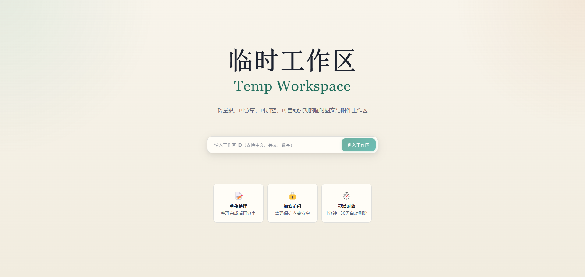
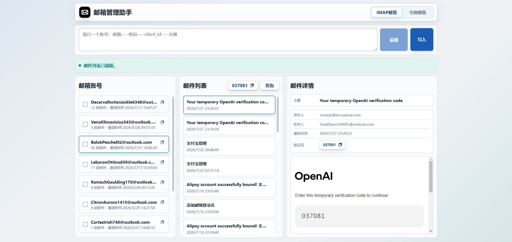
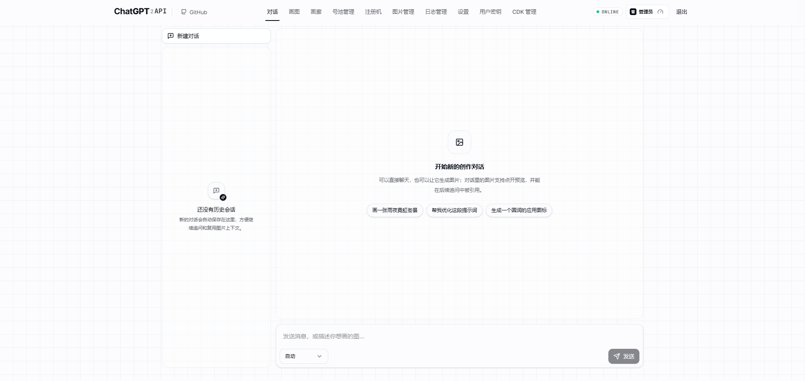
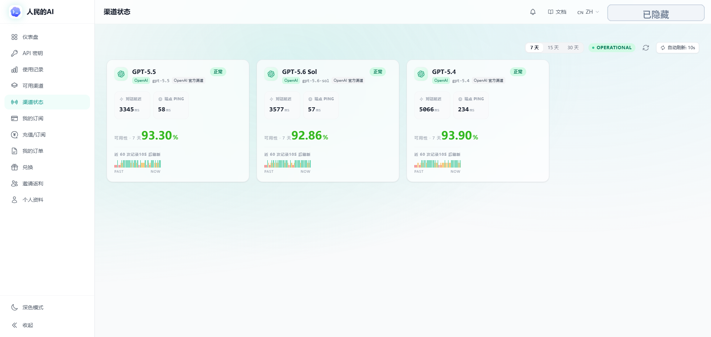

<!-- 居中开始 -->

<!-- 主图 -->
<picture>
  <source media="(prefers-color-scheme: dark)" srcset="https://cdn.jsdelivr.net/gh/sun0225SUN/sun0225SUN/assets/images/coding.gif" />
  <source media="(prefers-color-scheme: light)" srcset="https://cdn.jsdelivr.net/gh/sun0225SUN/sun0225SUN/assets/images/developer.svg" height="225px" />
  
</picture>

<!-- 空行 -->

&nbsp;

<!-- 打字特效 -->

<!-- 个人介绍 -->
<h3 align="center">
  🔥 技术发烧友  ·  🚀 科技爱好者  ·  🌐 开源贡献者
</h3>

  
  
  
  
  

  
  
  
  
  
  

<!-- 贪吃蛇 -->
<picture>
  <source media="(prefers-color-scheme: dark)" srcset="https://raw.githubusercontent.com/Richard2091/Richard2091/output/github-contribution-grid-snake-dark.svg">
  <source media="(prefers-color-scheme: light)" srcset="https://raw.githubusercontent.com/Richard2091/Richard2091/output/github-contribution-grid-snake.svg">
  
</picture>

<!-- 开源项目 -->

<!-- 项目列表 -->

  
  
   
  
  
   
  
  

<!-- Skill仓库 -->

<!-- 项目列表 -->

  
    
   
  
  

<!-- 已上线项目 -->

<!-- 项目预览 -->
<table align="center" width="860">
  <tr>
    <td width="50%" align="center">
      
      <h3>临时工作区</h3>
      
轻量级临时工作区，用于短周期资料创建、分享、加密与自动过期。

      
      
    </td>
    <td width="50%" align="center">
      
      <h3>邮箱管理助手</h3>
      
面向临时邮箱与令牌场景的邮箱账号、邮件列表和验证码提取工具。

      
      
    </td>
  </tr>
  <tr>
    <td width="50%" align="center">
      
      <h3>个人ChatGPT</h3>
      
自用对话、绘图、画廊、号池与日志管理入口，沉淀常用创作工作流。

      
    </td>
    <td width="50%" align="center">
      
      <h3>个人中转站</h3>
      
自用渠道聚合站点，用于负载均衡并查看多个模型通道可用性、延迟和服务状态。

      
    </td>
  </tr>
</table>

<!-- 居中结束 -->

